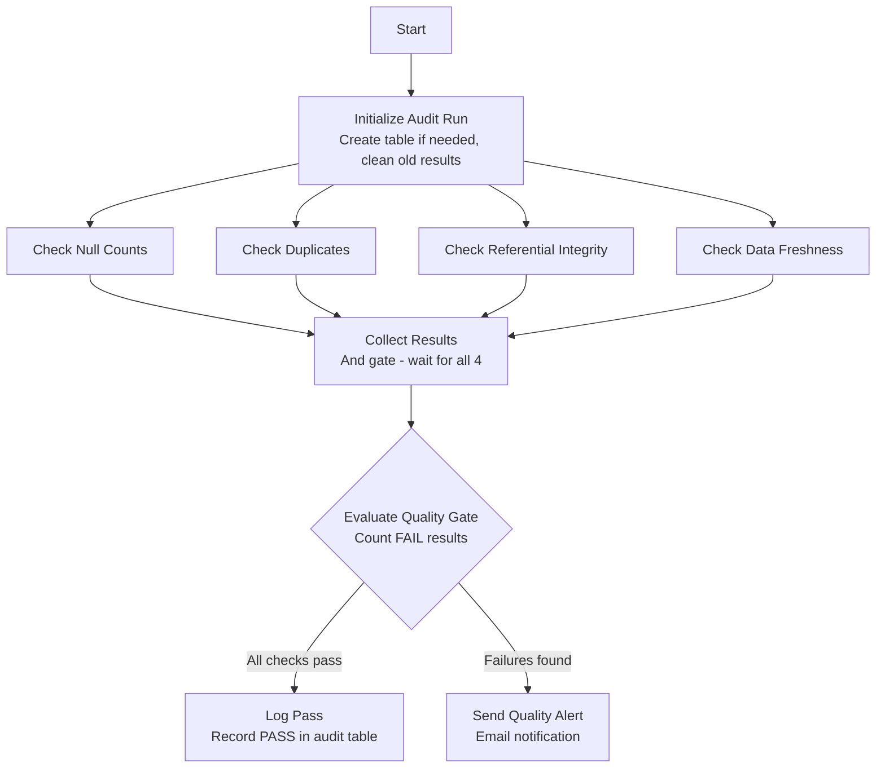

# Data Quality Monitoring Pipeline

## What Does This Pipeline Do?

Ever had a dashboard show wrong numbers because someone loaded bad data? This pipeline prevents that. It runs automated quality checks on your data warehouse tables and alerts you when something's off — before anyone sees a broken report.

Think of it as a health check for your data. It runs 4 types of inspections in parallel, logs everything to an audit table, and sends an email if anything fails.

## Real-World Use Case

An e-commerce company loads order data nightly from their transactional database into Snowflake. The analytics team builds dashboards on top of it. They've been burned before:

- Orders with NULL customer IDs broke the customer segmentation report
- Duplicate order records inflated revenue numbers by 15%
- A broken ETL job meant no new data for 3 days, but nobody noticed until the CEO asked

This pipeline runs after each nightly load and catches these issues automatically. If anything fails, the data engineering team gets an email BEFORE the business users see bad dashboards.

## Prerequisites

1. **Snowflake database** with tables you want to validate
2. **The tables you're checking exist** (this example uses `FACT_ORDERS` and `DIM_CUSTOMERS`)
3. **Project variables:**
   - `v_target_database` — database to validate
   - `v_target_schema` — schema to validate
   - `v_failure_threshold` — how many failed checks before alerting (default: 0 = any failure triggers alert)
   - `v_email_recipients` — who gets the alert
   - `v_smtp_hostname` — email relay

## The 4 Quality Checks

### 1. Null Count Check
**Question:** "Are there NULLs in columns that should never be NULL?"

Some columns must always have a value. An order without a customer ID is useless. An order without a date can't be placed on a timeline. This check counts NULLs in critical columns and flags any count > 0.

**Example:**
```
FACT_ORDERS.CUSTOMER_ID: 0 nulls → PASS ✅
FACT_ORDERS.ORDER_DATE:  3 nulls → FAIL ❌
```

### 2. Duplicate Check
**Question:** "Are there duplicate primary keys that shouldn't exist?"

Every order should have a unique ORDER_ID. Every customer should have a unique CUSTOMER_ID. If duplicates exist, something went wrong in the load process (maybe a MERGE key was misconfigured, or data was loaded twice).

**Example:**
```
FACT_ORDERS.ORDER_ID: 0 duplicates → PASS ✅
DIM_CUSTOMERS.CUSTOMER_ID: 47 duplicates → FAIL ❌
```

### 3. Referential Integrity Check
**Question:** "Do all foreign keys point to valid records?"

If an order has `CUSTOMER_ID = 999` but there's no customer with ID 999 in the customers table, that's an orphan record. It means either:
- The customer was deleted but their orders weren't
- The orders were loaded before the customers
- There's a bug in the source system

**Example:**
```
FACT_ORDERS.CUSTOMER_ID → DIM_CUSTOMERS: 12 orphans → FAIL ❌
```

### 4. Data Freshness Check
**Question:** "Has data been loaded recently?"

If your nightly load failed silently 3 days ago, your dashboards are showing stale data but nobody knows. This check looks at the MAX(`LOADED_AT`) timestamp and flags it if it's older than 24 hours.

**Example:**
```
FACT_ORDERS last loaded: 2 hours ago → PASS ✅
FACT_ORDERS last loaded: 36 hours ago → FAIL ❌ (threshold: 24 hours)
```

## How It Works — Step by Step

### Step 1: Initialize Audit Run

Creates the `DQ_AUDIT_RESULTS` table if it doesn't exist (first run). Then cleans up results older than 30 days to prevent unbounded growth.

This table is your permanent audit trail. Every check, every run, every result is recorded here. You can query it to see trends:
- "Has the null count been increasing over time?"
- "When did duplicates first appear?"

### Step 2: Run All 4 Checks (Parallel)

All 4 checks run at the same time. Each one:
1. Queries the target table for its specific validation
2. Calculates the result (count of issues)
3. Compares against the threshold
4. INSERTs a row into `DQ_AUDIT_RESULTS` with status PASS or FAIL

Running them in parallel means the pipeline finishes in the time of the SLOWEST check, not the SUM of all checks.

### Step 3: Collect Results (And Gate)

Waits for all 4 checks to finish. Once all have written their results to the audit table, the pipeline continues.

### Step 4: Evaluate Quality Gate

This is the pass/fail decision. It counts how many checks have `STATUS = 'FAIL'` in the current run:

- If failed checks <= `v_failure_threshold` (default 0) → component succeeds → **Log Pass**
- If failed checks > threshold → component errors → **Send Quality Alert**

The threshold is configurable. Set it to 0 for strict mode (any failure = alert). Set it to 2 if you want to tolerate minor issues but alert on widespread problems.

### Step 5a: Log Pass (happy path)

Records an OVERALL_QUALITY_GATE = PASS row in the audit table. Your monitoring can track this over time.

### Step 5b: Send Quality Alert (unhappy path)

Sends an email listing the check types that ran and directing the recipient to the `DQ_AUDIT_RESULTS` table for specifics.

## Pipeline Flow



## Key Concepts Explained

### What is a Quality Gate?

A quality gate is a checkpoint that either allows data to proceed downstream or blocks it. It's like a bouncer at a club — if the data doesn't meet the dress code (quality standards), it doesn't get in.

In practice, a quality gate determines whether downstream processes (dashboards, reports, ML models) should trust the data or not.

### Why Log Everything to a Table?

Emails get lost. Chat notifications get ignored. But a table? A table can be:
- Queried for trends ("show me all failures in the last 7 days")
- Visualized in a dashboard (quality score over time)
- Used for SLA reporting ("we maintained 99.5% data quality this quarter")
- Audited by compliance teams

### Why Parallel Checks?

If each check takes 30 seconds:
- Sequential: 30s × 4 = 2 minutes
- Parallel: 30s total (they all run at once)

For large tables where checks might take minutes, this matters.

### What's a Good Failure Threshold?

It depends on your tolerance:

| Threshold | Meaning | Use When |
|-----------|---------|----------|
| 0 | Alert on ANY failure | Critical production tables, financial data |
| 1-2 | Allow minor issues | Tables with known edge cases you're fixing |
| 5+ | Only alert on widespread problems | Early development, exploratory data |

## How to Add a New Check

Want to validate a new table or add a new check type? Follow this pattern:

1. **Create a new SQL Executor component** with your check logic
2. **INSERT result into `DQ_AUDIT_RESULTS`** with appropriate CHECK_NAME, TABLE_NAME, STATUS
3. **Connect it:** `Initialize Audit Run → Your New Check` and `Your New Check → Collect Results`
4. Done. The quality gate automatically picks up the new results.

Example — adding a "range check" for order amounts:
```sql
INSERT INTO DQ_AUDIT_RESULTS (CHECK_NAME, TABLE_NAME, COLUMN_NAME, CHECK_TYPE, RESULT_VALUE, THRESHOLD, STATUS)
SELECT
  'RANGE_CHECK_ORDER_AMOUNT',
  'FACT_ORDERS',
  'ORDER_AMOUNT',
  'OUT_OF_RANGE',
  COUNT(*),
  0,
  CASE WHEN COUNT(*) > 0 THEN 'FAIL' ELSE 'PASS' END
FROM FACT_ORDERS
WHERE ORDER_AMOUNT < 0 OR ORDER_AMOUNT > 1000000;
```

## Troubleshooting

| Symptom | Cause | Fix |
|---------|-------|-----|
| All checks show PASS but data is bad | Check logic doesn't cover the issue | Add more specific checks for the failure mode |
| Freshness check always fails | LOADED_AT column not being set | Ensure your load pipeline sets this column on INSERT |
| Duplicate check is slow | Table is very large | Add a time filter (only check recent data) |
| Alert email not sending | SMTP misconfigured | Verify `v_smtp_hostname` and that the relay allows your sender |
| Quality gate passes with known issues | Threshold too high | Lower `v_failure_threshold` to 0 for strict mode |

## Table Schema

```sql
-- Quality audit results (persistent, queryable)
CREATE TABLE DQ_AUDIT_RESULTS (
    RUN_ID STRING DEFAULT UUID_STRING(),
    CHECK_NAME STRING,        -- e.g., 'NULL_CHECK_ORDERS_CUSTOMER_ID'
    TABLE_NAME STRING,        -- e.g., 'FACT_ORDERS'
    COLUMN_NAME STRING,       -- e.g., 'CUSTOMER_ID'
    CHECK_TYPE STRING,        -- e.g., 'NULL_COUNT', 'DUPLICATE_COUNT', 'ORPHAN_RECORDS'
    RESULT_VALUE NUMBER,      -- the actual count of issues found
    THRESHOLD NUMBER,         -- the maximum acceptable count
    STATUS STRING,            -- 'PASS' or 'FAIL'
    EXECUTED_AT TIMESTAMP DEFAULT CURRENT_TIMESTAMP()
);
```

## Querying the Audit Table

Useful queries once you have data flowing:

```sql
-- Latest run results
SELECT * FROM DQ_AUDIT_RESULTS
WHERE EXECUTED_AT >= DATEADD(minute, -10, CURRENT_TIMESTAMP())
ORDER BY CHECK_NAME;

-- Failure trend over last 7 days
SELECT
  DATE(EXECUTED_AT) AS run_date,
  COUNT(*) AS total_checks,
  SUM(CASE WHEN STATUS = 'FAIL' THEN 1 ELSE 0 END) AS failed_checks,
  ROUND(SUM(CASE WHEN STATUS = 'PASS' THEN 1 ELSE 0 END) * 100.0 / COUNT(*), 1) AS pass_rate_pct
FROM DQ_AUDIT_RESULTS
WHERE EXECUTED_AT >= DATEADD(day, -7, CURRENT_TIMESTAMP())
GROUP BY DATE(EXECUTED_AT)
ORDER BY run_date;

-- Which checks fail most often?
SELECT CHECK_NAME, COUNT(*) AS failure_count
FROM DQ_AUDIT_RESULTS
WHERE STATUS = 'FAIL'
GROUP BY CHECK_NAME
ORDER BY failure_count DESC;
```
